# Xeldar FFXIV Configs
This is my personal config backup for FFXIV. Since I quit and return to the game frequently I often find myself doing all my plugins setup again and again so I made an installer that I can restore all my settings super fast whenever I reinstall the game or switch PCs.

## What's in here?
- **Skill Mods** - All my cool skill effect replacements (for Penumbra)
- **ReShade Presets** - Makes the game look way better
- **FFXIV Settings** - Keybinds, hotbars, character settings, macros, everything
- **XIVLauncher Plugin Configs** - DelvUI, DelvCD, QoLBar, BossMod, all that good stuff

## How to use
This is for my personal use. If you want to use it for some unknown reason don't clone this repository since its a big one.
1. Simply download the latest installer from releases section then run it.
2. It auto-detects your FFXIV install (or browse manually).
3. Check what you want to install.
4. Hit install.
5. Done.

* If you don't trust my exe file you can check the Installer folder and see the source code for yourself.
* If you can't read code you can just navigate around my Configs folder and copy and paste them by yourself.
* If you still have concerns build your own .exe file.

## Screenshots
### Installer UI
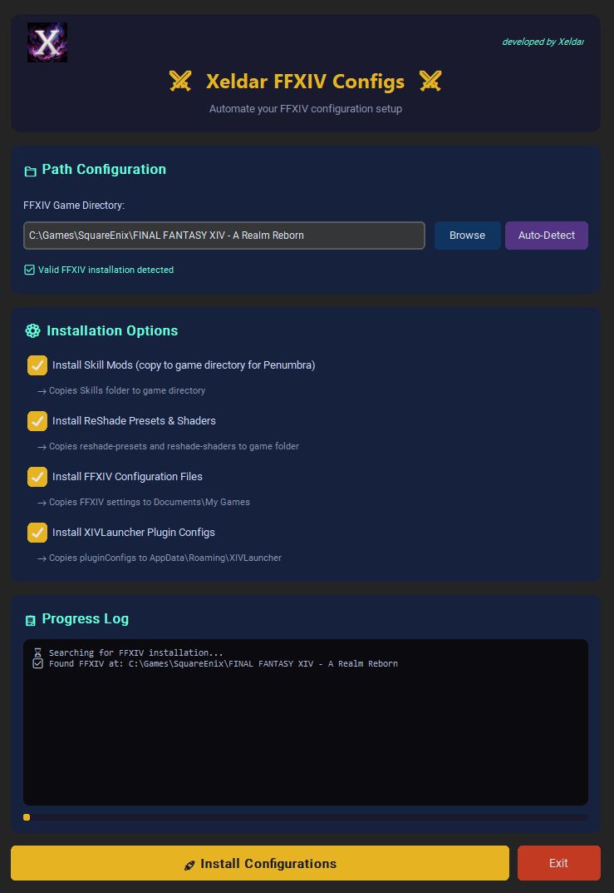

### Game UI
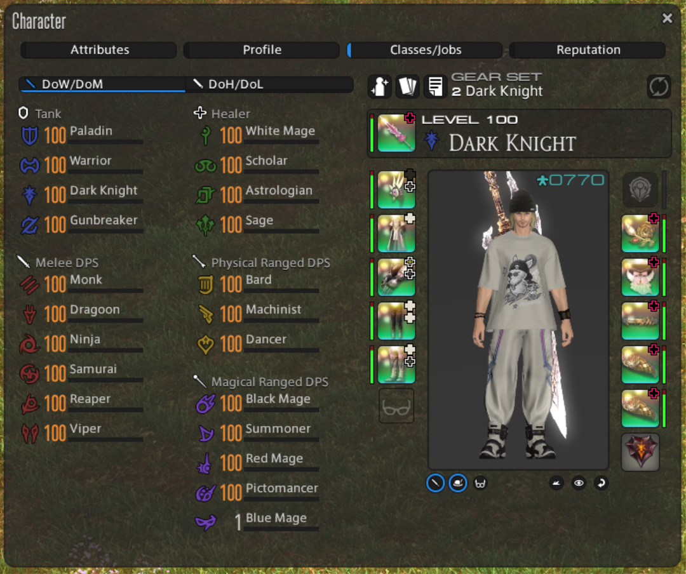
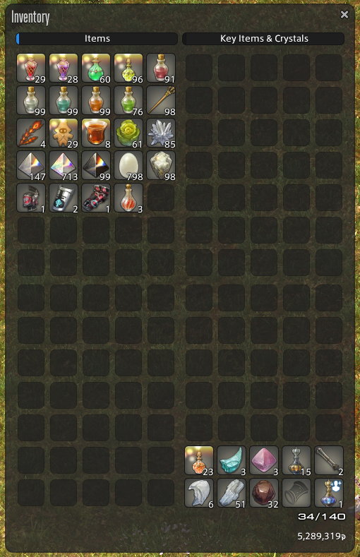
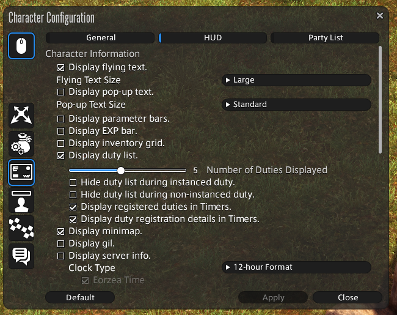
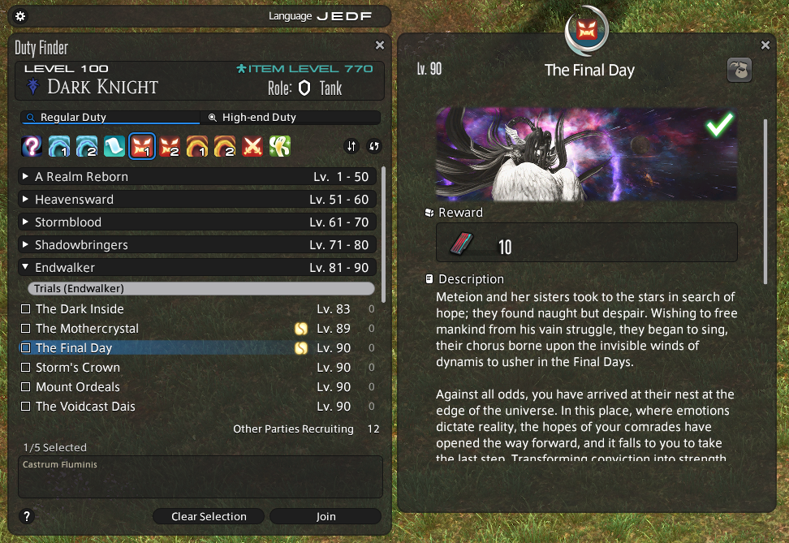

### Dalamud UI
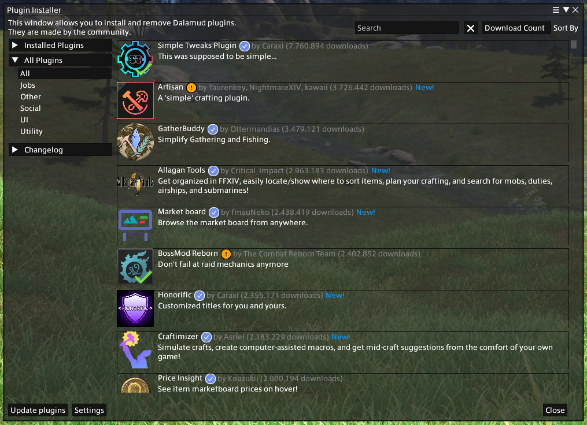

### LMeter UI
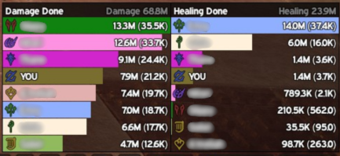

### DelvUI Tank
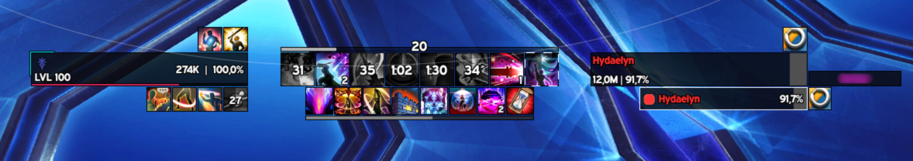
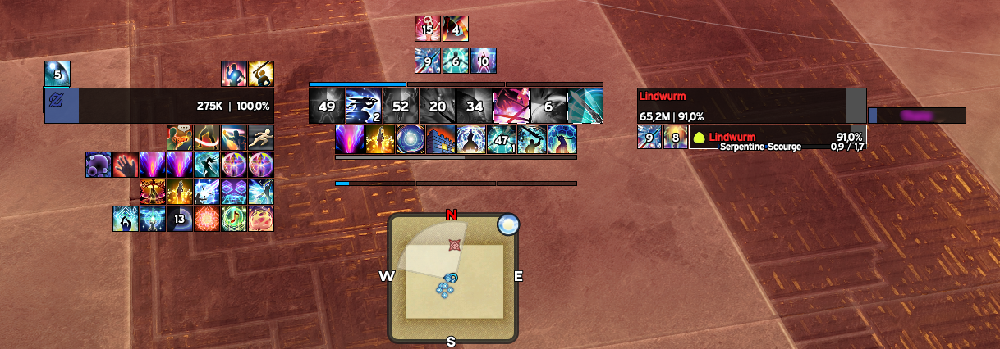

### DelvUI Healer
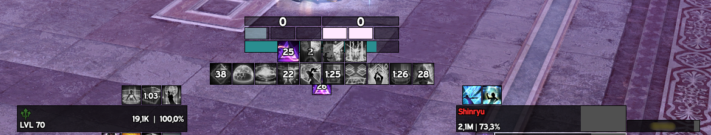
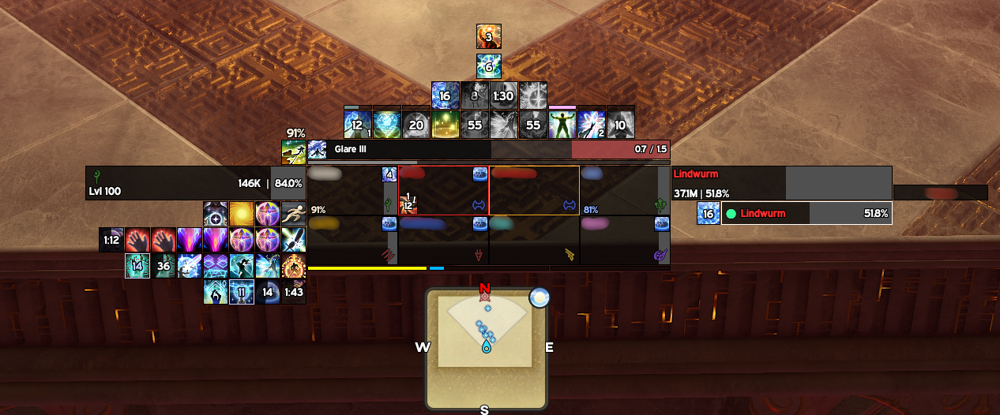

### DelvUI DPS
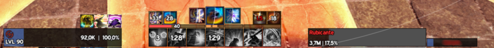
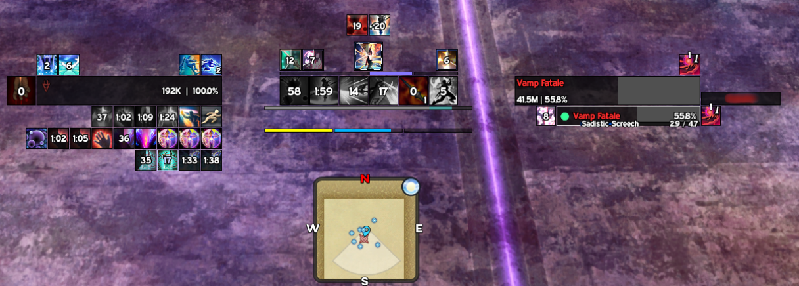

### DelvUI Party
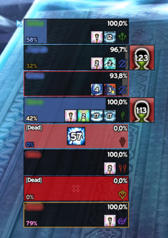

### DelvCD Global
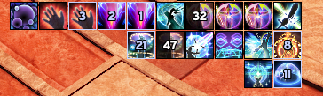

### Full UI

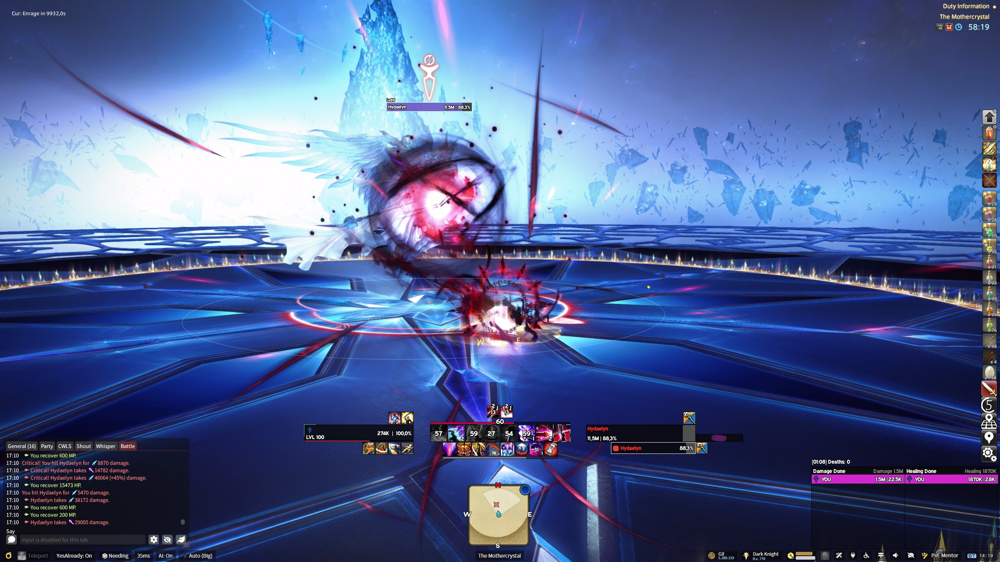

### Game with ReShade profile

## Notes
- My skill mods are from https://ko-fi.com/papapapachin
- My UI mod is from https://github.com/Sevii77/frost_ui
- In order to use ReShade presets, you need reshade installed separately https://reshade.me/#download
- After installing skill mods, open Penumbra and import them
- If you like something that I use, feel free to grab them